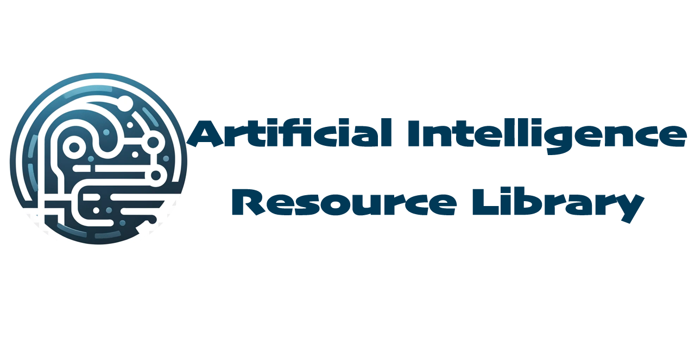

# Artificial Intelligence Resource Library

The AI Resource Library is a comprehensive collection of educational resources for individuals interested in artificial intelligence (AI) teaching and learning.

## Table of Contents

- [Artificial Intelligence Resource Library](#artificial-intelligence-resource-library)
  - [Table of Contents](#table-of-contents)
  - [Description](#description)
  - [Features](#features)
  - [Installation](#installation)
  - [Github](#github)
  - [Contributing](#contributing)
  - [License](#license)
  - [Contact](#contact)

## Description

The AI Resource Library is an open project aimed at providing a wide range of educational materials and resources for individuals interested in AI teaching and learning. It serves as a centralized repository where users can access various resources, such as articles, tutorials, videos, and code samples, to enhance their understanding of AI concepts and applications.

## Features

- Comprehensive collection of AI educational resources
- Resources covering various AI topics, including machine learning, deep learning, natural language processing, computer vision, and more
- Regularly updated with new resources to ensure relevance and currency

## Installation

There are no specific installation requirements for accessing the AI Resource Library. Simply visit the [website](https://ai-resource-library.com) to start exploring the available resources.

## Github 

- [f/awesome-chatgpt-prompts](https://github.com/f/awesome-chatgpt-prompts)
- [rockbenben/ChatGPT-Shortcut](https://github.com/rockbenben/ChatGPT-Shortcut)
- [yzfly/awesome-chatgpt-zh](https://github.com/yzfly/awesome-chatgpt-zh)
- [ahmetbersoz/chatgpt-prompts-for-academic-writing](https://github.com/ahmetbersoz/chatgpt-prompts-for-academic-writing)

## Contributing

We welcome contributions from the community to help improve and expand the AI Resource Library. If you would like to contribute, please follow the guidelines outlined in the [CONTRIBUTING.md](https://github.com/ai-resource-library/contributing) file.

## License

The AI Resource Library is released under the [MIT License](https://opensource.org/licenses/MIT). Feel free to use, modify, and distribute the resources in this library for personal or educational purposes.

## Contact

If you have any questions, suggestions, or feedback regarding the AI Resource Library, please reach out to our team at airesourcelibrary@gmail.com. We value your input and are committed to continuously improving the library based on user feedback.